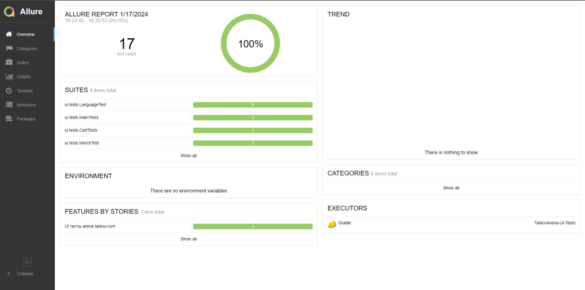
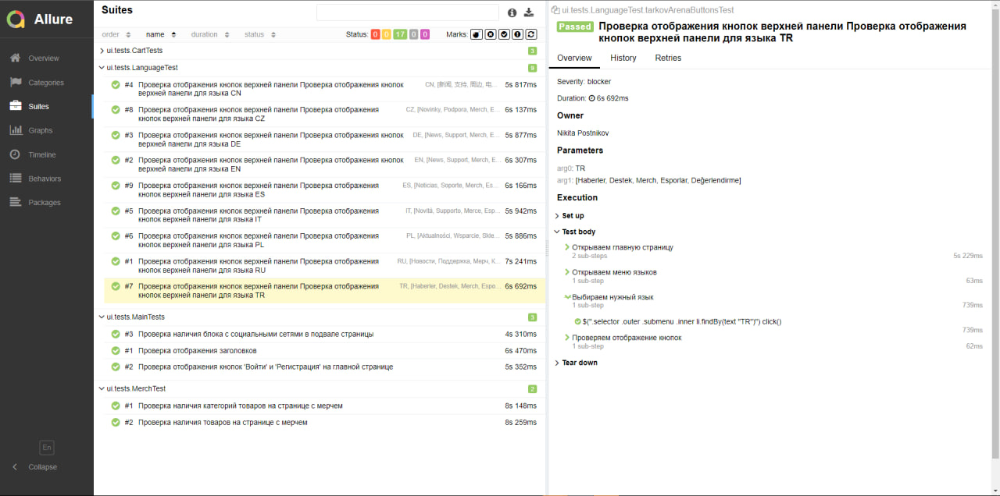

<h1 >Демо-проект автоматизации тестирования UI на <a href="https://arena.tarkov.com/">Escape from Tarkov: Arena</a></h1>

## :page_with_curl: Содержание

* <a href="#tools">Технологии и инструменты</a>

* <a href="#cases">Реализованные проверки</a>

* <a href="#allure">Allure Report отчеты</a>

## Технологии и инструменты

| Java                                                                                                    | IntelliJ Idea                                                                                                                | Allure                                                                                                                    | GitHub                                                                                                    | JUnit 5                                                                                                           | Gradle                                                                                                   |
|:--------------------------------------------------------------------------------------------------------|------------------------------------------------------------------------------------------------------------------------------|---------------------------------------------------------------------------------------------------------------------------|-----------------------------------------------------------------------------------------------------------|-------------------------------------------------------------------------------------------------------------------|----------------------------------------------------------------------------------------------------------|
|  |  |  |  |  |  |
- В данном проекте автотесты написаны на языке <code>Java</code> с использованием фреймворка для тестирования Selenide.
- В качестве сборщика был использован - <code>Gradle</code>.
- Использованы фреймворки <code>JUnit 5</code> и [Selenide](https://selenide.org/).

## :heavy_check_mark: Реализованные проверки

-  Успешная/неуспешная авторизация пользователя
-  Успешная/неуспешная регистрация пользователя
-  Получение данных пользователя
-  Получение данных о пользователях из списка
-  Удаление пользователя
-  Создание нового пользователя
-  Изменение данных пользователя

## </a> Allure Report отчеты

### Основное окно

### Отчеты по тестам

> В отчете по тестам присутствует развернутая информация по запросам и ответам.

